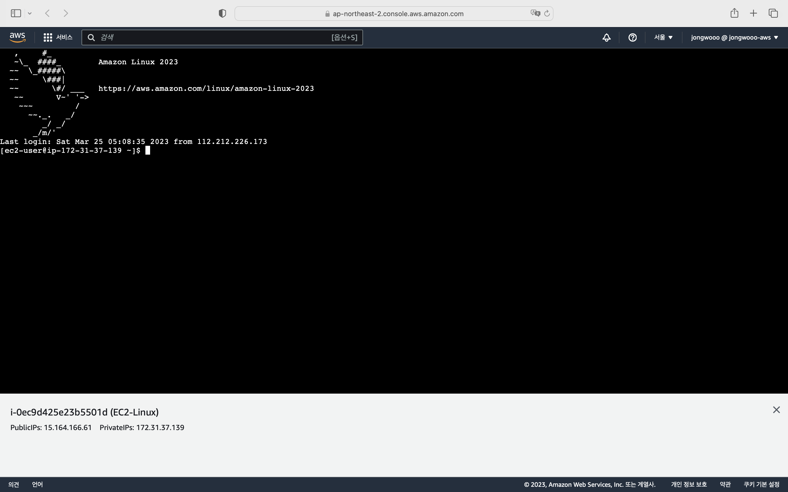

AWS EC2 인스턴스에 접속하는 방법은 여러 가지가 있습니다.
대표적으로 ssh 클라이언트를 사용하는 방법이 있는데, 책이나 인터넷 강의에서도 많이 다루고 있습니다.

ssh 클라이언트를 사용하여 접속하는 방법은 다음과 같습니다.

```bash
$ ssh -i /path/key-pair-name.pem instance-user-name@instance-public-dns-name
```


이런 방식은 ssh 키를 저장하고 관리해야 하기 때문에 번거로움이 있습니다.

EC2 인스턴스에 접속하는 또 다른 방법은 [EC2 Instance Connect](https://docs.aws.amazon.com/ko_kr/AWSEC2/latest/UserGuide/ec2-instance-connect-methods.html)를 사용하는 것입니다.
이 방법은 EC2 인스턴스에 접속하기 위해 ssh 키를 저장하고 관리할 필요가 없습니다.

> EC2 Instance Connect는 Linux 인스턴스에 대해서만 지원합니다.

EC2 Instance Connect는 권한이 있는 사용자가 연결할 때마다 일회성 ssh 키를 생성하고 인스턴스 메타데이터에 60초 동안 유지합니다.
이 메타데이터를 통해 사용자를 인증하고 ssh 접속을 수행합니다.

이번 글에서는 EC2 Instance Connect를 사용하여 EC2 인스턴스에 접속하는 방법을 소개합니다.

## TL;DR

EC2 Instance Connect를 사용하여 EC2 인스턴스에 접속할 수 있습니다.

## EC2 Instance Connect 사용하기

### 준비 사항

EC2 인스턴스 하나를 생성하겠습니다.

AMI는 Linux 배포판 중 하나인 [Amazon Linux 2023](https://aws.amazon.com/ko/linux/amazon-linux-2023/?amazon-linux-whats-new.sort-by=item.additionalFields.postDateTime&amazon-linux-whats-new.sort-order=desc)을 사용하겠습니다.


EC2 Instance Connect도 ssh 프로토콜을 사용하기 때문에 ssh 접속을 허용해야 합니다.
보안 그룹에서 22번 포트를 열어줍니다.


다른 설정은 기본값으로 두고 인스턴스를 생성합니다.

### EC2 Instance Connect 사용하기

EC2 인스턴스의 상태가 **실행 중**으로 바뀌면 EC2 Instance Connect를 사용할 수 있습니다.
인스턴스 목록에서 해당 인스턴스를 선택한 후, 우측 상단의 연결을 클릭합니다.


인스턴스 생성 시 사용자 지정 사용자 이름을 설정하지 않았으므로 기본 사용자 `ec2-user`로 접속해보겠습니다.
아래의 연결을 클릭하면 웹 브라우저 상에서 EC2 인스턴스에 접속할 수 있습니다.



## 마치며

EC2 Instance Connect를 사용하면 ssh 키를 저장하고 관리할 필요가 없기 때문에 번거로움이 줄어듭니다.
복잡한 ssh 키 관리 전략에 대한 대안으로 EC2 Instance Connect를 사용해보시기 바랍니다.

## 참고 링크

- [Using Amazon EC2 Instance Connect for SSH access to your EC2 Instances](https://aws.amazon.com/ko/blogs/compute/new-using-amazon-ec2-instance-connect-for-ssh-access-to-your-ec2-instances/)
- [Connect to your Linux instance using SSH](https://docs.aws.amazon.com/AWSEC2/latest/UserGuide/AccessingInstancesLinux.html)
- [Connect to your Linux instance using EC2 Instance Connect](https://docs.aws.amazon.com/AWSEC2/latest/UserGuide/Connect-using-EC2-Instance-Connect.html)
