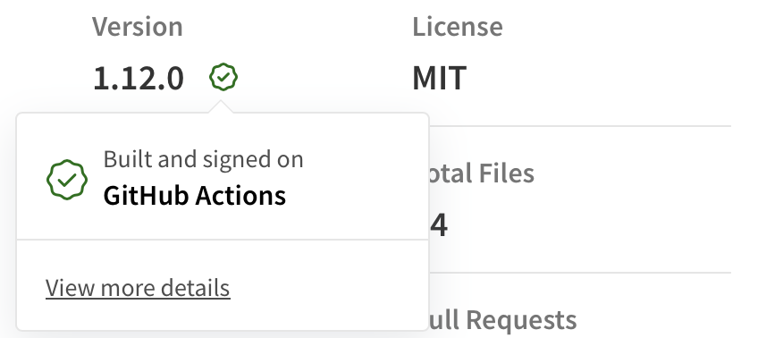
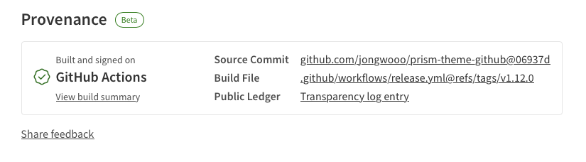

npm의 자격 증명이 유출되면, 공격자는 [npm 레지스트리](https://www.npmjs.com)에 조작된 패키지를 게시할 수 있습니다.
신뢰할 수 있는 패키지로 가장한 악성 패키지를 다운로드하고 사용하는 개발자는 악성 코드에 노출될 수 있습니다.
이러한 위협은 패키지를 사용하는 서비스에 큰 영향을 미칠 수 있으며, 신뢰성과 보안을 저해할 수 있습니다.

이를 방지하기 위해 npm은 패키지와 함께 출처를 게시할 수 있는 기능인 [npm provenance](https://docs.npmjs.com/generating-provenance-statements#about-npm-provenance)를 제공합니다.
어디에서 빌드되고, 어떤 경로를 통하여 게시되는지에 대한 메타데이터를 담은 **provenance**를 함께 게시하여 패키지의 신뢰성을 보장할 수 있습니다.



이번 글에서는 GitHub Actions에서 패키지와 함께 출처를 게시하는 방법을 소개합니다.

## TL;DR

npm 레지스트리에 패키지와 함께 출처를 게시하여 패키지의 신뢰성을 보장할 수 있습니다.

## npm provenance로 패키지의 신뢰성 보장하기

GitHub Actions에서 provenance 기능을 사용하려면 아래의 권한이 필요합니다.

```yaml
permissions:
  id-token: write # to mint an ID-token
```

또한, 워크플로우는 [GitHub-hosted runner](https://docs.github.com/en/actions/using-github-hosted-runners/about-github-hosted-runners#supported-runners-and-hardware-resources)에서 구동되어야 합니다.

```yaml
runs-on: ubuntu-latest # or windows-latest, macos-latest, etc.
```

기존 `npm publish` 명령에 `--provenance` 플래그를 추가하면 패키지와 함께 출처를 게시할 수 있습니다.

```yaml
run: npm publish --provenance
```

### 워크플로우에 적용하기

아래의 예시는 npm 레지스트리에 패키지와 함께 출처를 게시하는 워크플로우입니다.

```yaml
name: Publish Package to npmjs
on:
  release:
    types: [created]
jobs:
  build:
    runs-on: ubuntu-latest
    permissions:
      contents: read
      id-token: write
    steps:
      - uses: actions/checkout@v3
      - uses: actions/setup-node@v3
        with:
          node-version: "18.x"
          registry-url: "https://registry.npmjs.org"
      - run: npm install -g npm
      - run: npm ci
      - run: npm publish --provenance --access public
        env:
          NODE_AUTH_TOKEN: ${{ secrets.NPM_TOKEN }}
```

## 마치며



npm provenance를 통하여 패키지의 출처를 게시함으로써, 개발자들은 출처 정보를 확인하고 신뢰할 수 있는 패키지를 선택할 수 있게 됩니다.

만약 GitHub Actions 상에서 패키지를 게시하고 있다면, 위의 예시를 참고하여 적용해보시는 것을 추천드립니다.

## 참고 링크

- [Introducing npm package provenance](https://github.blog/2023-04-19-introducing-npm-package-provenance/)
- [Generating provenance statements](https://docs.npmjs.com/generating-provenance-statements)
- [Npm package provenance with Github Actions](https://www.darraghoriordan.com/2023/04/25/npm-package-provenance-github-actions/)
