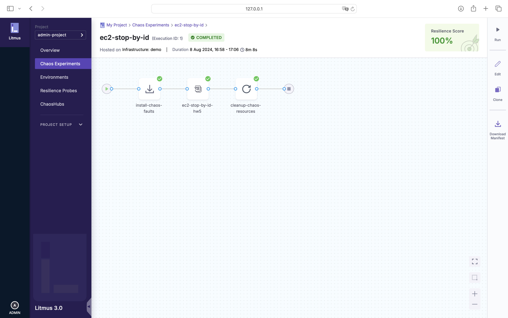

대규모 분산 소프트웨어 시스템의 발전에 따라, 클라우드 네이티브 환경에서 서비스를 운영하는 사례가 증가하고 있습니다.
이러한 환경에서는 수많은 서비스들이 복잡하게 상호작용하며, 서비스 간 의존성이 매우 높아져 관리가 어렵습니다.

만약 이 중 하나의 서비스에 장애가 발생한다면 다른 서비스에 예상치 못한 영향을 미칠 수 있으며 시스템 전체의 안정성을 저해할 가능성이 있습니다.

예를 들어, 다음과 같은 장애 상황이 발생할 수 있습니다.

- AWS EC2 인스턴스가 중지되는 경우
- AWS EBS 볼륨이 분리되는 경우
- 쿠버네티스 클러스터 노드가 삭제되는 경우
- 예기치 않은 CPU 또는 메모리 스파이크가 발생하는 경우
- ...

이러한 장애 상황이 발생했을 때 시스템이 어떻게 동작하는지 확인하고, 장애에 견고한 시스템을 구축하기 위해 [카오스 엔지니어링](https://principlesofchaos.org/)을 활용할 수 있습니다.

카오스 엔지니어링은 운영 환경에서 갑작스러운 장애에도 견고한 시스템을 구축하기 위해, 시스템의 신뢰성을 실험하는 분야입니다.

이 글에서는 오픈소스 카오스 엔지니어링 도구 [LitmusChaos](https://litmuschaos.io)를 활용하여 AWS 환경에 장애를 주입하는 실험 예제 중 하나인 [EC2 Stop By ID](https://litmuschaos.github.io/litmus/experiments/categories/aws/ec2-stop-by-id/)를 단계별로 소개합니다.

## TL;DR

- 카오스 엔지니어링은 복잡한 분산 시스템 환경에서 장애에 견고한 시스템을 구축하기 위한 엔지니어링 기법입니다.
- LitmusChaos는 오픈소스 카오스 엔지니어링 도구입니다.
- LitmusChaos를 활용하여 `EC2 Stop By ID` 실험을 단계별로 소개합니다.

## LitmusChaos에서 EC2 인스턴스 중지 실험하기

### Prerequisites

- [Docker](https://docs.docker.com/engine/install/), [minikube](https://minikube.sigs.k8s.io/docs/start/?arch=%2Fmacos%2Fx86-64%2Fstable%2Fbinary+download) 설치하기 (또는 쿠버네티스 클러스터 환경)
- [AWS 액세스 키 발급하기](https://docs.aws.amazon.com/ko_kr/IAM/latest/UserGuide/id_credentials_access-keys.html)
- [EC2 인스턴스](https://docs.aws.amazon.com/en_us/ec2/) 구성하기

### LitmusChaos 구성하기

> 이번 예제에서는 minikube 환경을 기준으로 설명합니다.

새로운 쉘을 열고 LitmusChaos를 설치합니다.

```bash
helm repo add litmuschaos https://litmuschaos.github.io/litmus-helm/
helm install chaos litmuschaos/litmus --namespace=litmus --create-namespace --set portal.frontend.service.type=NodePort
```

frontend 서비스에 접속하기 위해, URL을 생성합니다.

```bash
minikube service chaos-litmus-frontend-service -n litmus --url
```

생성된 URL을 브라우저에 입력하면 LitmusChaos에 접속할 수 있습니다.
초기 아이디 / 비밀번호는 `admin` / `litmus` 입니다.


### Chaos Infrastructure 구성하기

LitmusChaos에 접속하면, 다음과 같이 Chaos Infrastructure를 활성화하라는 메시지가 표시됩니다.


아래와 같이 Chaos Infrastructure가 활성화된 것을 확인할 수 있습니다.
이번 예제에서는 `demo`라는 이름으로 새로운 Chaos Infrastructure를 생성합니다.


### AWS 엑세스 키 등록하기

발급 받은 AWS 액세스 키를 사용할 수 있도록 Litmus가 구성되어 있는 네임스페이스에 Secret을 생성합니다.

`cloud-secret.yaml` 파일을 생성하고 아래와 같이 작성합니다.

```yaml
apiVersion: v1
kind: Secret
metadata:
  name: cloud-secret
type: Opaque
stringData:
  cloud_config.yml: |-
    # Add the cloud AWS credentials respectively
    [default]
    aws_access_key_id = XXXXXXXXXXXXXXXXXXX
    aws_secret_access_key = XXXXXXXXXXXXXXX
```

아래의 명령어를 통해 Secret을 생성합니다.

```bash
kubectl apply -f cloud-secret.yaml -n litmus
```

### Resilience Probe 정의하기

Resilience Probe는 대상의 이상적인 상태를 정의하고, 실험의 결과를 평가하는 데 사용됩니다.
이번 실험에서는 HTTP Probe를 설정하여 EC2 인스턴스의 상태를 확인합니다.


필수 필드인 Timeout, Interval, Attempt를 각 `5s`, `5s`, `3`으로 설정합니다.


HTTP 요청을 보낼 URL을 설정합니다. Method, Criteria, Response Code를 각각 `GET`, `==`, `200`으로 설정합니다.


### Experiment 생성하기

새로운 Experiment를 생성합니다.
실험을 실행할 Chaos Infrastructure는 기존에 생성한 `demo`를 선택합니다.


Experiment는 Blank Canvas, Templates from ChaosHubs, Upload YAML 중에서 선택할 수 있습니다.
이번에는 Blank Canvas를 선택합니다.


Blank Canvas가 생성되었습니다. Add 버튼을 클릭하여 Chaos Fault를 추가합니다.


Chaos Fault 중에서 AWS의 `ec2-stop-by-id`를 선택합니다.


필수 필드인 `EC2_INSTANCE_ID`와 `REGION`을 입력합니다.
`EC2_INSTANCE_ID`에는 중지할 EC2 인스턴스의 ID를 입력하고, `REGION`은 EC2 인스턴스가 위치한 리전을 입력합니다.


이전에 생성한 Resilience Probe를 연결합니다. 테스트가 끝나면 가설을 검증하도록 Mode는 `End of Test (EOT)`를 선택합니다.


### 실험과 검증



실험을 실행하면, 대상 인스턴스에 카오스가 주입되고 Probe가 인스턴스의 상태를 확인합니다.
Resilience Probe대로 인스턴스가 정상적으로 재시작되면, Resilience Score가 `100%`으로 표시됩니다.

## 마치며

이번 글에서는 LitmusChoas에서 AWS EC2 인스턴스를 중지하는 간단한 실험 예제를 통해 카오스 엔지니어링에 대해 살펴보았습니다.
카오스 엔지니어링은 단순히 장애를 주입하는 것이 아니라, 통제된 실험을 통해 시스템의 잠재적 장애 지점을 파악하여 문제가 발생하기 전에 미리 파악하는 것입니다.
이를 통해 시스템의 안정성을 높이고, 장애에 견고한 시스템을 구축할 수 있습니다.

## 참고 링크

- [Principles of chaos engineering](https://principlesofchaos.org)
- [ChaosCenter Installation | Litmus Docs](https://docs.litmuschaos.io/docs/getting-started/installation)
- [EC2 Stop By ID | Litmus Experiments](https://litmuschaos.github.io/litmus/experiments/categories/aws/ec2-stop-by-id/)
