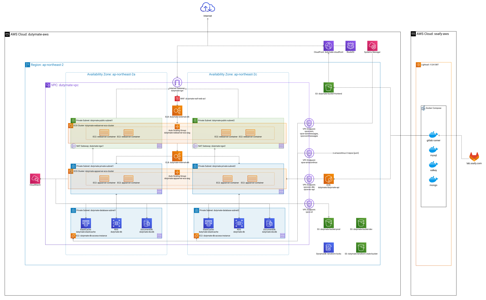

삼성 청년 SW 아카데미에서 [프로젝트](https://dutymate.net)를 진행하면서 AWS 인프라 구성을 맡았습니다.



인프라를 설계하며 가장 중점으로 두었던 것은 보안이었습니다.
서비스에서 병동 정보와 간호 직위 등의 민감한 정보를 수집하기 때문에 사용자 데이터를 안전하게 관리해야 했습니다.

또한, 서비스를 출시하면서 악성 공격을 받을 수 있다는 것도 염두에 두어야 했습니다.
실제로 서비스를 출시하고 나서도 매주 4만 건을 웃도는 악성 공격 요청이 있었습니다.

이러한 보안 위협에도 안전하게 사용자 데이터를 적재하기 위해 여러 고민이 있었습니다.
그 중 하나가 바로 프라이빗 서브넷에 데이터베이스를 배치하는 것이었습니다.

프라이빗 서브넷에 데이터베이스를 배치하면 외부에서 직접 접근할 수 없기 때문에 보안에 더욱 유리합니다.
그러나 프라이빗 서브넷에 데이터베이스를 배치하면 외부에서 접근할 수 없어 데이터베이스에 접근하기 위해서는 별도의 방법이 필요합니다.

이 글에서는 AWS Session Manager를 이용하여 프라이빗 서브넷의 데이터베이스에 접근하는 방법을 소개합니다.

## TL;DR

- AWS Session Manager로 프라이빗 서브넷의 데이터베이스에 접근할 수 있습니다.

## AWS SSM으로 안전하게 Private RDS 접근하기 with Terraform

### VPC 및 프라이빗 서브넷 구성

먼저, CIDR 블록이 `10.0.0.0/16`인 VPC와 CIDR 블록이 `10.0.1.0/24`인 프라이빗 서브넷을 생성합니다.

> 예제에서는 SSM 접속만 필요하므로, NAT Gateway 등은 구성하지 않습니다.

```hcl
resource "aws_vpc" "vpc" {
  cidr_block = "10.0.0.0/16"
  instance_tenancy = "default"
  enable_dns_support = true
  enable_dns_hostnames = true
}

resource "aws_subnet" "private_subnet" {
  vpc_id            = aws_vpc.vpc.id
  cidr_block        = "10.0.1.0/24"
  availability_zone = "ap-northeast-2a"
}

resource "aws_route_table" "private_route_table" {
  vpc_id = aws_vpc.vpc.id
}

resource "aws_route_table_association" "private_route_table_association" {
  subnet_id      = aws_subnet.private_subnet.id
  route_table_id = aws_route_table.private_route_table.id
}
```

### 보안 그룹 구성

> 내부 정책에 따라 필요한 포트만 허용하도록 더 강하게 설정할 수도 있습니다.

```hcl
resource "aws_security_group" "sg_mysql" {
  vpc_id = aws_vpc.vpc.id

  ingress {
    from_port   = 3306
    to_port     = 3306
    protocol    = "tcp"
    security_groups = [aws_security_group.sg_ssm_instance.id]
  }
  
  egress {
    from_port   = 0
    to_port     = 0
    protocol    = "-1"
    cidr_blocks = []
  }
}

resource "aws_security_group" "sg_ssm_instance" {
  vpc_id = aws_vpc.vpc.id

  egress {
    from_port   = 3306
    to_port     = 3306
    protocol    = "tcp"
    cidr_blocks = ["10.0.1.0/24"]
  }
  
  egress {
    from_port   = 443
    to_port     = 443
    protocol    = "tcp"
    security_groups = [aws_security_group.sg_vpce_ssm.id]
  }
}
```

### RDS 구성

> username과 password가 노출되지 않도록, variable로 관리하는 것을 추천합니다.

```hcl
resource "aws_db_subnet_group" "dbsg" {
  subnet_ids = [aws_subnet.private_subnet.id]
}

resource "aws_db_instance" "db" {
  allocated_storage      = 20
  engine                 = "mysql"
  engine_version         = "8.0.40"
  instance_class         = "db.t3.micro"
  username               = var.mysql_username
  password               = var.mysql_password
  identifier             = "example-db"
  skip_final_snapshot    = true
  multi_az               = false
  db_subnet_group_name   = aws_db_subnet_group.dbsg.name
  vpc_security_group_ids = [aws_security_group.sg_mysql.id]
}
```

### VPC 엔드포인트 구성

Session Manager는 VPC 엔드포인트를 통해 프라이빗 서브넷에 접근합니다.
따라서 3가지의 VPC 엔드포인트를 구성하고, 보안 그룹을 구성하여 Session Manager가 EC2 인스턴스에 접근할 수 있도록 합니다.

이때, `ssm`은 세션 연결 관리, `ssmmessages`는 세션 메시지 전달, `ec2messages`는 EC2 인스턴스와의 통신을 담당합니다.
이 역할은 EC2 인스턴스가 Session Manager와 정상적으로 통신하고, SSM 포트포워딩 기능을 사용할 수 있게 해줍니다.

> service_name을 제외한 구성이 동일하다면, for_each를 활용해 여러 개의 VPC 엔드포인트를 한 번에 생성할 수도 있습니다.

```hcl
resource "aws_security_group" "sg_vpce_ssm" {
  vpc_id = aws_vpc.vpc.id

  ingress {
    from_port       = 443
    to_port         = 443
    protocol        = "tcp"
    security_groups = [aws_security_group.sg_ssm_instance.id]
  }
}

resource "aws_vpc_endpoint" "vpce_ssm" {
  vpc_id              = aws_vpc.vpc.id
  vpc_endpoint_type   = "Interface"
  service_name        = "com.amazonaws.${var.aws_region}.ssm"
  subnet_ids          = [aws_subnet.private_subnet.id]
  security_group_ids  = [aws_security_group.sg_vpce_ssm.id]
  private_dns_enabled = true
}

resource "aws_vpc_endpoint" "vpce_ssmmessages" {
  vpc_id              = aws_vpc.vpc.id
  vpc_endpoint_type   = "Interface"
  service_name        = "com.amazonaws.${var.aws_region}.ssmmessages"
  subnet_ids          = [aws_subnet.private_subnet.id]
  security_group_ids  = [aws_security_group.sg_vpce_ssm.id]
  private_dns_enabled = true
}

resource "aws_vpc_endpoint" "vpce_ec2messages" {
  vpc_id              = aws_vpc.vpc.id
  vpc_endpoint_type   = "Interface"
  service_name        = "com.amazonaws.${var.aws_region}.ec2messages"
  subnet_ids          = [aws_subnet.private_subnet.id]
  security_group_ids  = [aws_security_group.sg_vpce_ssm.id]
  private_dns_enabled = true
}
```

### IAM 역할 및 정책 구성

Session Manager를 통해 RDS에 접근하기 위해 IAM 역할과 정책을 구성합니다.
해당 IAM 역할은 SSM Agent가 정상 동작하기 위한 최소 권한인 `AmazonSSMManagedInstanceCore`를 부여합니다.
이 정책이 있어야 EC2 인스턴스가 Systems Manager 콘솔에 표시되고, 세션을 열 수 있습니다.

```hcl
resource "aws_iam_role" "ssm_role" {
  assume_role_policy = jsonencode({
    Version = "2012-10-17",
    Statement = [
      {
        Effect    = "Allow",
        Principal = { Service = "ec2.amazonaws.com" },
        Action    = "sts:AssumeRole"
      }
    ]
  })
}

resource "aws_iam_role_policy_attachment" "ssm_attach" {
  role       = aws_iam_role.ssm_role.name
  policy_arn = "arn:aws:iam::aws:policy/AmazonSSMManagedInstanceCore"
}

resource "aws_iam_instance_profile" "ssm_instance_profile" {
  role = aws_iam_role.ssm_role.name
}
```

### EC2 인스턴스 구성

Session Manager를 통해 RDS에 접근할 수 있도록 동일한 서브넷에 EC2 인스턴스를 생성합니다.

> EC2 인스턴스에는 SSM Agent가 설치되어 있어야 합니다. 따라서 SSM Agent가 설치된 AMI를 사용해야 합니다.

```hcl
data "aws_ami" "amazonlinux2" {
  owners      = ["amazon"]
  most_recent = true

  filter {
    name   = "name"
    values = ["amzn2-ami-hvm*"]
  }
}

resource "aws_instance" "db_access_instance" {
  ami                         = data.aws_ami.amazonlinux2.id
  instance_type               = "t2.micro"
  subnet_id                   = aws_subnet.private_subnet.id
  associate_public_ip_address = false
  iam_instance_profile        = aws_iam_instance_profile.ssm_instance_profile.name
  vpc_security_group_ids      = [aws_security_group.sg_ssm_instance.id]
}
```

### MySQL 클라이언트 설치를 위한 VPC 엔드포인트 구성

사용한 AMI는 기본적으로 MySQL 클라이언트가 설치되어 있지 않습니다.
따라서 MySQL 클라이언트를 설치해야 합니다.

Amazon Linux 2의 yum 저장소는 S3에 호스팅되어 있습니다.
따라서 외부 인터넷이 차단된 프라이빗 서브넷에서는 yum 패키지 설치를 위해 S3 Gateway 타입 VPC 엔드포인트를 구성해야 합니다.

> 이 엔드포인트는 Amazon Linux의 패키지 설치 목적으로만 사용되므로, 정책 설정을 통해 필요한 권한만 부여합니다.

```hcl
resource "aws_vpc_endpoint" "vpce_amazonlinux" {
  vpc_id            = aws_vpc.vpc.id
  vpc_endpoint_type = "Gateway"
  service_name      = "com.amazonaws.${var.aws_region}.s3"
  route_table_ids   = [aws_route_table.private_route_table.id]

  policy = <<POLICY
{
  "Version": "2012-10-17",
  "Statement": [
    {
      "Effect": "Allow",
      "Action": [
        "s3:GetObject",
        "s3:ListBucket",
        "s3:PutObject"
      ],
      "Resource": [
        "arn:aws:s3:::amazonlinux.ap-northeast-2.amazonaws.com/*",
        "arn:aws:s3:::amazonlinux-2-repos-ap-northeast-2/*"
      ],
      "Principal": "*"
    }
  ]
}
POLICY
}
```

### MySQL 클라이언트 설치

Session Manager 콘솔을 통해 EC2 인스턴스에 접속한 후, MySQL 클라이언트를 설치합니다.

```bash
sudo amazon-linux-extras enable mysql8.0
sudo yum install mysql -y
```

## SSM 포트포워딩 및 RDS 연결 확인

SSM 포트포워딩 기능을 사용하면, EC2 인스턴스를 통해 마치 로컬에 있는 DB처럼 접근할 수 있습니다.
이를 통해, 별도 Bastion Host 없이 안전한 데이터베이스 접근 환경을 구성할 수 있습니다.

```bash
aws ssm start-session \
    --target i-xxxxxxxxxxxxxxxxx \
    --document-name AWS-StartPortForwardingSession \
    --parameters '{"portNumber":["3306"],"localPortNumber":["3306"]}'
```

세션이 연결되면, 로컬에서 아래 명령어로 RDS 접속이 가능합니다.

```bash
mysql -h 127.0.0.1 -P 3306 -u admin -p
```

## 마치며

AWS의 Session Manager와 VPC 엔드포인트를 적절히 활용하면, 외부 노출 없이 안전하게 데이터베이스를 운영할 수 있습니다.
특히, Bastion Host 없이도 보안과 접근 편의성을 모두 잡을 수 있으니, 보안이 중요한 서비스라면 적극적으로 도입을 검토해 보세요.

## 참고 링크

- [AWS Systems Manager Session Manager](https://docs.aws.amazon.com/systems-manager/latest/userguide/session-manager.html)
- [AWS SSM으로 EC2 인스턴스에 접근하기 (SSH 대체)](https://musma.github.io/2019/11/29/about-aws-ssm.html)
