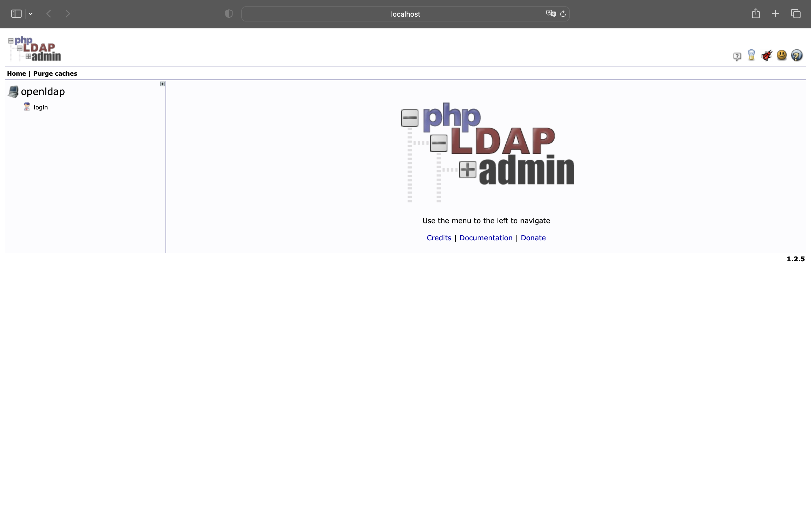
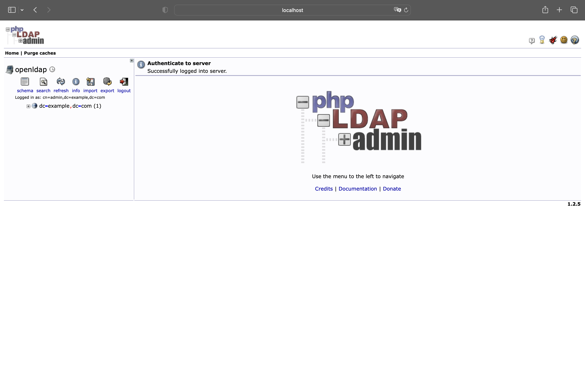

팀에서 기존 LDAP 인증 기능에 대해 리팩터링을 진행하던 중, 기능을 테스트할 환경이 필요했습니다.
하지만 LDAP이라는 생소한 기술을 처음부터 배우고 환경을 구성하는 것은 시간 상의 문제가 있었습니다.
고민하던 중, Docker를 활용해 LDAP 서버를 구성할 수 있다는 것을 알게 되었습니다.
이 글에서는 Docker로 간단하게 LDAP 서버를 구성하는 방법을 소개합니다.

## TL;DR

`osixia`에서 제공하는 두 Docker 이미지를 활용하여 LDAP 서버를 구성할 수 있습니다.

- [osixia/openldap](https://hub.docker.com/r/osixia/openldap)
- [osixia/phpldapadmin](https://hub.docker.com/r/osixia/phpldapadmin)

## What is LDAP?

여러 서비스를 운용하다보면 사용자, 패스워드, 그룹 정보를 하나하나 관리하기 어려워집니다.
이럴 때는 디렉터리 서비스(Directory Service)를 사용하면 편리합니다.
디렉터리 서비스는 사용자, 패스워드, 그룹 정보를 하나의 서버에 저장하고 관리할 수 있습니다.

LDAP(Lightweight Directory Access Protocol)은 디렉터리 서비스를 구현하기 위한 소프트웨어 프로토콜입니다.
이 프로토콜을 구현한 서버를 LDAP 서버라고 합니다.

## Docker로 간단하게 LDAP 서버 구성하기

### OpenLDAP

[OpenLDAP](https://www.openldap.org)은 LDAP을 구현한 오픈소스 프로젝트입니다.
OpenLDAP의 [Docker 이미지](https://hub.docker.com/r/osixia/openldap)를 사용하면 간단하게 OpenLDAP을 구성할 수 있습니다.

### phpLDAPAdmin

[phpLDAPAdmin](https://www.phpldapadmin.org)은 LDAP 서버를 관리하기 위한 웹 UI 클라이언트입니다.
OpenLDAP처럼 [Docker 이미지](https://hub.docker.com/r/osixia/phpldapadmin)를 사용하면 간단하게 phpLDAPAdmin을 구성할 수 있습니다.

### docker-compose.yml 파일 작성하기

[Docker Compose](https://docs.docker.com/compose/)는 여러 개의 Docker 컨테이너를 정의하고 실행하기 위한 도구입니다.
`docker-compose.yml` 파일을 작성하여 여러 컨테이너를 묶어서 관리할 수 있습니다.

다음은 `docker-compose.yml` 파일에 OpenLDAP과 phpLDAPAdmin을 구성한 예시입니다.

```yml
version: "3.8"

services:
  openldap:
    image: osixia/openldap:latest
    container_name: openldap
    ports:
      - "389:389"
      - "636:636"
    volumes:
      - ./data/certificates:/container/service/slapd/assets/certs
      - ./data/slapd/database:/var/lib/ldap
      - ./data/slapd/config:/etc/ldap/slapd.d
    environment:
      LDAP_LOG_LEVEL: "256"
      LDAP_ORGANISATION:
      LDAP_DOMAIN: "example.com"
      LDAP_ADMIN_USERNAME: "admin"
      LDAP_ADMIN_PASSWORD: "admin"
      LDAP_CONFIG_PASSWORD: "config"
      LDAP_BASE_DN: "dc=example,dc=com"
      LDAP_TLS_CRT_FILENAME: "ldap.crt"
      LDAP_TLS_KEY_FILENAME: "ldap.key"
      LDAP_TLS_CA_CRT_FILENAME: "example.com.ca.crt"
      LDAP_READONLY_USER: "true"
      LDAP_READONLY_USER_USERNAME: "readonly"
      LDAP_READONLY_USER_PASSWORD: "readonly"
    networks:
      - openldap

  phpldapadmin:
    image: osixia/phpldapadmin:latest
    container_name: phpldapadmin
    hostname: phpldapadmin
    ports:
      - "8080:80"
    environment:
      PHPLDAPADMIN_LDAP_HOSTS: "openldap"
      PHPLDAPADMIN_HTTPS: "false"
    depends_on:
      - openldap
    networks:
      - openldap

networks:
  openldap:
    driver: bridge
```

`docker-compose.yml` 파일을 작성했다면, 다음 명령어를 통해 OpenLDAP과 phpLDAPAdmin을 실행합니다.

```bash
$ docker-compose up -d
Creating openldap ... done
Creating phpldapadmin ... done
```

### phpLDAPAdmin 접속하기

컨테이너를 실행했다면, [localhost:8080](http://localhost:8080)를 통해 phpLDAPAdmin에 접속할 수 있습니다.



phpLDAPAdmin에 로그인하기 위해서는 다음과 같이 입력해야 합니다.

- Login DN: `cn=<USER>,dc=<DOMAIN_NAME>,dc=<TOP_LEVEL_DOMAIN>`
- Password: `<PASSWORD>`



Login DN에 `cn=admin,dc=example,dc=com`, Password에 `admin`을 입력하면 위와 같이 admin 계정으로 phpLDAPAdmin에 로그인할 수 있습니다.

## 참고 링크

- [알아두면 쓸모있는 LDAP](https://www.samsungsds.com/kr/insights/ldap.html)
- [How to setup lightweight LDAP Server with docker](https://txconsole.com/how-to-setup-lightweight-ldap-server-with-docker/)
