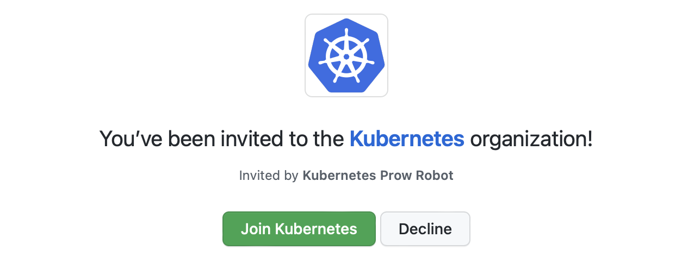

[쿠버네티스](https://kubernetes.io)는 컨테이너화된
애플리케이션을 자동으로 배포, 스케일링 및 관리해주는 오픈소스 프로젝트입니다.
쿠버네티스는 현시점에서 이미 사실상 표준(de-facto standard)이 되었고,
컨테이너 기반 인프라 시장을 선도하고 있습니다.

<!-- end -->

쿠버네티스는 오픈소스 프로젝트이기 때문에 누구나 기여할 수 있습니다.
쿠버네티스에 기여하는 방법은 여러가지가 있지만, 가장 쉽게 기여를 시작하는 방법은
[쿠버네티스 문서](https://kubernetes.io/docs/home/)에 기여하는 것입니다.

저는 쿠버네티스 조직 [멤버](https://github.com/orgs/kubernetes/people?query=jongwooo)로서,
쿠버네티스 SIG Docs 한글화팀에서 쿠버네티스 문서 한글화 기여를 하고 있습니다.
이 글에서는 저의 경험을 바탕으로 쿠버네티스 문서에 기여하는 방법을 소개하고자 합니다.

## TL;DR

쿠버네티스 문서에 기여하는 방법은 다음과 같습니다.

1. CLA 서명과 Code of Conduct 준수
2. 일감 찾기
3. 기여하기
4. 풀 리퀘스트 생성하기

## 쿠버네티스 문서에 기여하기

쿠버네티스 커뮤니티는 문서를 코드 형태로 관리하고 있습니다.
문서는 [kubernetes/website](https://github.com/kubernetes/website) 저장소에
마크다운(`.md`) 형태로 작성되어, [Hugo](https://gohugo.io/)라고 하는 정적 사이트 생성기를 통해 퍼블리싱 됩니다.

### SIG Docs에 참여하기

쿠버네티스 커뮤니티에는 특정 분야에 관심이 있는 멤버들의 모임인 SIG(Special Interest Group)가 있습니다.
그 중 SIG Docs는 쿠버네티스 전반에 대한 문서를 작성하고, 업데이트하며 유지보수하는 일을 주로 수행합니다.

SIG Docs는 쿠버네티스 커뮤니티에서 가장 활발하게 활동하는 SIG 중 하나입니다.
SIG Docs에 참여하고 싶다면, [Kubernetes Slack](https://kubernetes.slack.com/) 채널 `#sig-docs`에 참여하면 됩니다.
한글화 팀의 경우, `#kubernetes-docs-ko` 채널에서 활동하고 있습니다.

### CLA 서명과 Code of Conduct 살펴보기

쿠버네티스에 기여하려면 [Contributor License Agreement(CLA)](https://github.com/kubernetes/community/blob/master/CLA.md)에 서명해야 합니다.
CLA에 서명한다는 것은 기여자의 코드에 대한 권리를 쿠버네티스 커뮤니티에 양도한다는 의미입니다.
CLA 서명은 풀 리퀘스트를 생성하고 기여를 진행할 때 필수적으로 체크되는 항목이기 때문에,
기여를 진행할 계정으로 서명을 완료해야 합니다.

또한, 쿠버네티스 커뮤니티는 [Code of Conduct](https://github.com/kubernetes/community/blob/master/code-of-conduct.md)를 준수해야 합니다.
Code of Conduct를 숙지하고 준수하는 것은 쿠버네티스 뿐만 아니라
커뮤니티에 기여하는 데 있어서 필수적인 요소입니다.

### 일감 찾기

[쿠버네티스 한글 문서](https://kubernetes.io/ko/docs/) 중, 제목이 영문이고 `(EN)` 표시가 되어있는 문서는
아직 한글화가 진행되지 않은 문서입니다.
해당 문서에 대해 [이슈](https://github.com/kubernetes/website/issues)를 생성하고 기여를 진행할 수 있습니다.
이때 현재 하고자 하는 일감이 이미 다른 사람에 의해 진행 중인지 확인하는 것이 중요합니다.

### 기여하기

기여를 진행하기에 앞서 [kubernetes/website](https://github.com/kubernetes/website) 저장소를 fork한 후 로컬에 clone합니다.

```bash
$ git clone https:/github.com/<YOUR_USERNAME>/website.git
$ cd website
```

로컬에 clone한 저장소에서 현재 한글화 팀에서 작업하는 브랜치를 바탕으로 새로운 브랜치를 생성합니다.
작업 브랜치는 슬랙 채널 `#kubernetes-docs-ko` 또는 열려 있는 이슈를 통해 확인할 수 있습니다.

```bash
$ git fetch upstream
$ git checkout -b dev-1.27-ko.1
```

이제 필요한 위치에 파일을 생성합니다. 예를 들어, `what-is-kubernetes.md` 파일을 번역하고자 한다면
영문 문서 `contents/en/` 내 `what-is-kubernetes.md` 파일을 복사하여 생성하면 됩니다.

```bash
$ cp contents/en/docs/concepts/overview/what-is-kubernetes.md contents/ko/docs/concepts/overview/what-is-kubernetes.md
```

이제 생성한 파일에 대해 번역 작업을 진행합니다.
번역은 [쿠버네티스 문서 한글화 가이드](https://kubernetes.io/ko/docs/contribute/localization_ko/)를 참고하면 됩니다.

```diff
- # What is Kubernetes?
+ # 쿠버네티스란?
```

번역이 완료되면, `git commit`을 통해 커밋을 생성합니다.
이때 되도록 하나의 커밋으로 만들어줍니다.

```bash
$ git commit -a -m "[ko] Translate what-is-kubernetes.md into Korean"
```

다른 사람이 작업한 내용과 충돌이 발생하지 않도록 rebase를 진행합니다.
conflict가 발생하면 충돌을 해결한 후 다시 커밋을 생성합니다.

```bash
$ git fetch upstream
$ git rebase upstream/dev-1.27-ko.1
```

이제 생성한 커밋을 원격 저장소에 push합니다.

```bash
$ git push origin dev-1.27-ko.1
```

### 풀 리퀘스트 생성하기

이제 생성한 커밋을 원격 저장소에 push했으므로, 풀 리퀘스트를 생성할 수 있습니다.
이때 base branch를 `dev-1.27-ko.1`로 설정해야 합니다.

풀 리퀘스트를 생성했다면, 리뷰어의 의견에 따라 풀 리퀘스트를 업데이트해야 합니다.
리뷰어의 `LGTM`과 승인자의 `Approve`를 받으면 해당 풀 리퀘스트의 내용이 반영될 수 있습니다.

## 마치며



쿠버네티스 커뮤니티는 기여의 정도에 따라 [쿠버네티스 멤버십](https://kubernetes.io/ko/docs/contribute/participate/roles-and-responsibilities/)을
부여합니다. 처음에는 Non-member Contributor부터 시작하여, 기여를 지속적으로 진행하면서 멤버, 리뷰어, 승인자 등의 권한을 부여받을 수 있습니다.

쿠버네티스 기여를 시작하시는 분들께 이 글이 도움 되었으면 합니다.

## 참고 링크

- [K8s 문서에 기여하기](https://kubernetes.io/ko/docs/contribute/)
- [쿠버네티스 문서 한글화 가이드](https://kubernetes.io/ko/docs/contribute/localization_ko/)
