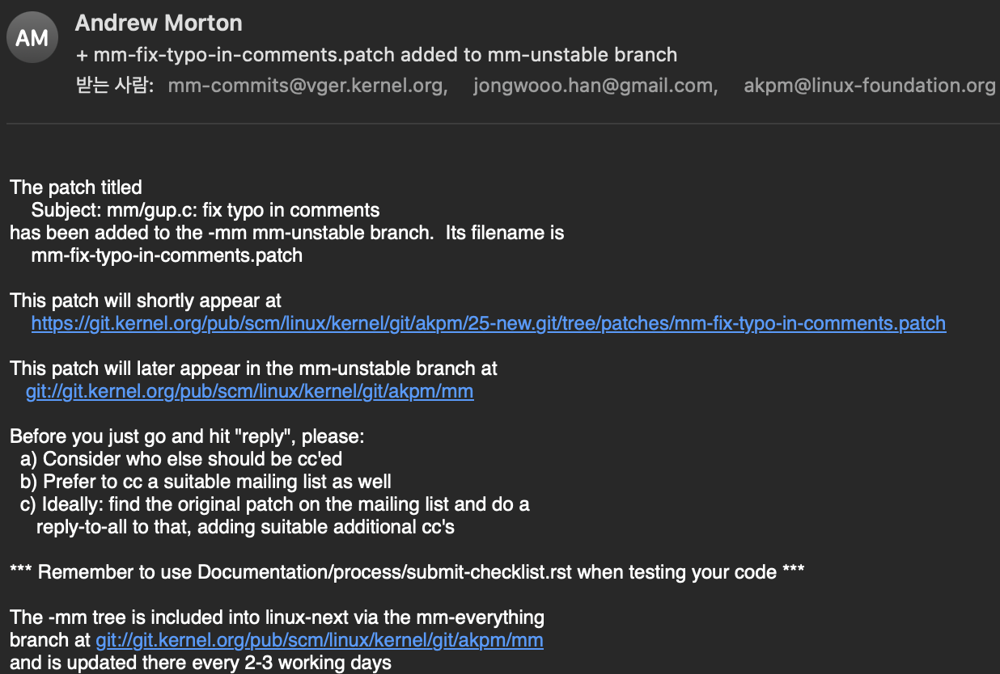

[리눅스 커널](https://git.kernel.org/pub/scm/linux/kernel/git/torvalds/linux.git)은 오픈소스 프로젝트로 개발되고 있습니다.
커널 개발은 작업한 내용을 패치 형태로 이메일을 통해 제출하는 방식으로 진행됩니다.
이 글에서는 실제로 주석 오탈자를 수정하고 패치 코드를 제출해보며 리눅스 커널에 기여하는 방법에 대해 간단히 소개합니다.

<!-- end -->

## TL;DR

리눅스 커널에 기여하는 방법은 다음과 같습니다.

1. git clone
2. 소스 코드 수정
3. 변경 사항 커밋
4. 패치 생성
5. 메인테이너와 메일링 리스트 확인
6. 패치 제출
7. 패치 리뷰

## 리눅스 커널에 기여하기

### git clone

다음 명령어를 통해 리눅스 커널 소스 코드를 clone 할 수 있습니다.

```bash
git clone git://git.kernel.org/pub/scm/linux/kernel/git/torvalds/linux.git
```

### 소스 코드 수정

커널의 메모리를 관리하는 [MM(Memory Management)](https://linux-mm.org) 모듈에서 주석 오탈자를 발견하여 수정하였습니다.

```diff
mm/gup.c | 2 +-
1 file changed, 1 insertion(+), 1 deletion(-)

- * and subsequently re faulted). However it does guarantee that the page
+ * and subsequently re-faulted). However it does guarantee that the page
```

### 변경 사항 커밋

새로운 브랜치를 생성하여 수정한 소스 코드를 커밋합니다.
이때 `-s` 옵션을 사용하여 서명을 추가해야 합니다.

```bash
git checkout -b mm/fix-typo-in-comments
git add mm/gup.c
git commit -sm "mm: fix typo in comments"
```

### 패치 생성

다음 명령어를 통해 패치를 생성할 수 있습니다.

> 커밋을 하나만 했기 때문에 `HEAD^`를 사용했습니다.
> 만약 커밋을 여러 개 했다면 `HEAD~3`과 같이 사용할 수 있습니다.

```bash
git format-patch HEAD^
```

패치 파일 `0001-mm-fix-typo-in-comments.patch`가 생성된 것을 확인할 수 있습니다.

### 메인테이너와 메일링 리스트 확인

아래 스크립트를 실행하여 패치를 어디에 제출해야 하는지 확인할 수 있습니다.

```bash
./scripts/get_maintainer.pl 0001-mm-fix-typo-in-comments.patch
```

스크립트를 실행하면 아래와 같이 메인테이너와 메일링 리스트가 출력됩니다.

```text
Andrew Morton <akpm@linux-foundation.org>
linux-mm@kvack.org (open list:MEMORY MANAGEMENT)
linux-kernel@vger.kernel.org (open list)
```

### 패치 제출

`git send-email` 명령어를 통하여 패치를 제출합니다.

> git send-email 명령어는 smtp 서버를 통해 메일을 전송합니다.
> gmail의 smtp 서버를 사용하고자 하는 경우 [링크](https://git-scm.com/docs/git-send-email#_use_gmail_as_the_smtp_server)를 참고하세요.

```bash
git send-email --to akpm@linux-foundation.org --cc linux-mm@kvack.org --cc linux-kernel@vger.kernel.org 0001-mm-fix-typo-in-comments.patch
```

### 패치 검토

패치를 제출하면 메인테이너가 패치를 검토합니다.
메인테이너는 패치에 대해 의견을 남기거나 패치를 반영할 수 있습니다.



## 마치며

> "내 코드가 반영되면 얼마나 기쁠까?"

단순한 오탈자 수정이었지만, 커널에 패치를 제출하고 검토를 받는 과정은 정말 즐거웠습니다.
오픈소스에 입문하는 분들은 한 번 도전해보시길 추천합니다.

## 참고 링크

- [Submitting patches: the essential guide to getting your code into the kernel](https://www.kernel.org/doc/html/latest/process/submitting-patches.html)
- [git send-email command](https://git-scm.com/docs/git-send-email)
