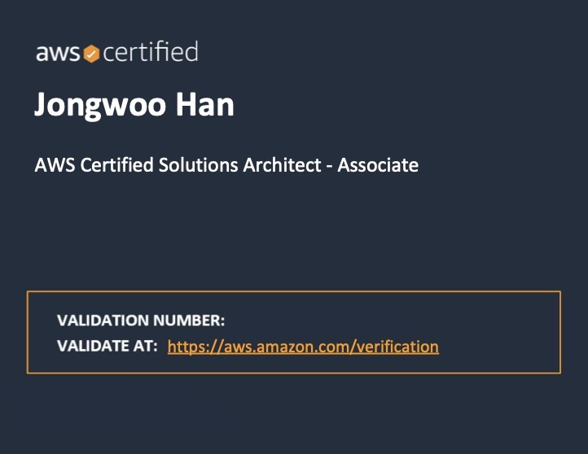

지난 1일 [AWS Solutions Architect - Associate (SAA-C03)](https://aws.amazon.com/ko/certification/certified-solutions-architect-associate/)을 취득하였습니다.
이번 글에서는 AWS Certified Solutions Architect - Associate에 대한 간략한 소개와 준비 과정, 그리고 시험 관련 팁에 관해 이야기해 보려 합니다.

<!-- end -->

## TL;DR

AWS Certified Solutions Architect - Associate에 대한 소개와 준비 과정, 시험 관련 팁에 대해 다룹니다.

## AWS 공인 자격증 취득 후기

### AWS에서 제공하는 여러 공인 자격증

")

AWS에서는 클라우드에 대한 기초적인 이해를 다루는 Cloud Practitioner부터 AWS의 여러 서비스를 활용하여 아키텍처를 설계하는 Solutions Architect까지 [다양한 자격증](https://aws.amazon.com/ko/certification/)을 제공하고 있습니다.

이번에 취득한 [AWS Certified Solutions Architect - Associate](https://aws.amazon.com/ko/certification/certified-solutions-architect-associate/)은 다양한 AWS 서비스에 대한 기본적인 지식과 기술을 다루는 자격증입니다.

### 준비 과정

AWS의 여러 서비스들을 이미 사용해본 경험이 있었기 때문에 AWS의 기본적인 내용들은 어렵지 않게 이해할 수 있었습니다.

개념을 익히기 위해 2주 정도 Udemy의 [Ultimate AWS Certified Solutions Architect Associate SAA-C03](https://www.udemy.com/course/aws-certified-solutions-architect-associate-saa-c03/) 강의를 수강하였습니다.
이 강의는 어느 정도 가격이 있는 편이지만, 일주일에 한 번 정도 할인이 되는 경우가 있어 저렴하게 구매할 수 있습니다.

덤프를 통해 문제 풀이를 연습하는 방법도 있었지만, SAA-C02에서 업데이트된 지 1년이 채 되지 않은 때라 활용하지 않았습니다.

### 시험 관련 팁

AWS 공인 자격증 시험은 65문항으로 구성되어 있으며, 130분 동안 시험을 진행합니다.

시험을 등록할 때 언어를 선택할 수 있는데, 한국어로 신청하게 되면 한국어와 영어 원문 둘 다 확인할 수 있기 때문에 한국어로 응시하는 것이 좋습니다.
또한, 영어가 모국어가 아닌 사용자를 위한 추가 시험 시간을 요청할 수 있습니다.

## 마치며

800점이 조금 안 되는 점수로 시험을 통과하여 AWS Certified Solutions Architect - Associate을 취득하였습니다.
이 글이 자격증을 준비하시는 분들께 도움이 되었으면 좋겠습니다.

## 참고 링크

- [AWS Certification](https://aws.amazon.com/ko/certification/)
- [AWS Certified Solutions Architect - Associate](https://aws.amazon.com/ko/certification/certified-solutions-architect-associate/)
- [Ultimate AWS Certified Solutions Architect Associate SAA-C03](https://www.udemy.com/course/aws-certified-solutions-architect-associate-saa-c03/)
