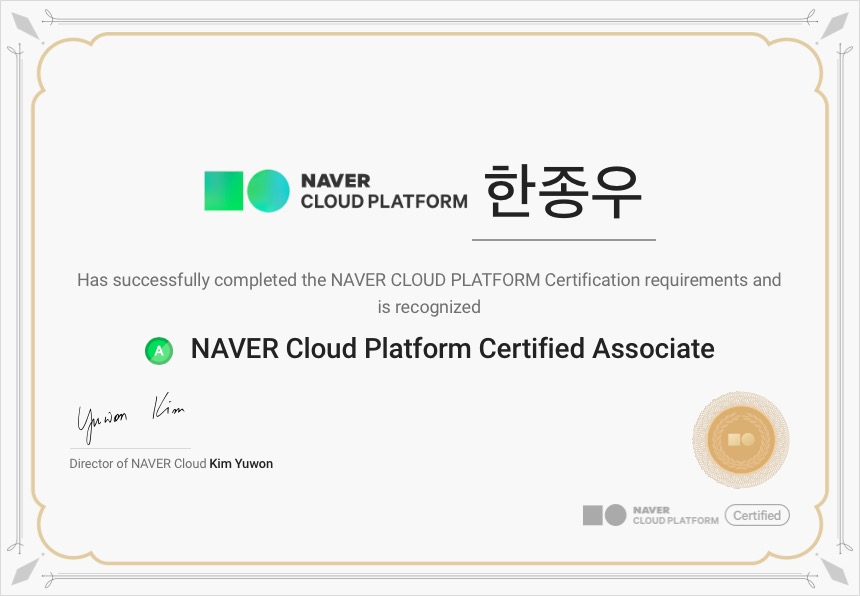

지난 6일 [NAVER Cloud Platform Certified Associate)](https://edu.ncloud.com/certi)를 취득하였습니다.
이번 글에서는 NAVER Cloud Platform Certified Associate에 대한 간략한 소개와 준비 과정, 그리고 시험 관련 팁에 관해 이야기해 보려 합니다.

<!-- end -->

## TL;DR

NAVER Cloud Platform Certified Associate에 대한 소개와 준비 과정, 시험 관련 팁에 대해 다룹니다.

## 네이버 클라우드 플랫폼 기술자격증 취득 후기

### 네이버 클라우드 플랫폼 기반의 여러 기술자격증

")

네이버 클라우드 플랫폼 기반의 [기술자격증](https://edu.ncloud.com/certi)은 Associate, Professional, Expert의 3단계로 이루어져 있습니다.

기술자격증은 레벨별로 시험과목이 상이하며, 각 시험과목은 필기로 구성되어 있습니다.
Associate의 경우 1과목(100), Professional의 경우 3과목(200, 202, 207), Expert의 경우 4과목(301, 302, 303, 305)을 합격해야 자격증을 취득할 수 있습니다.
Associate를 취득하기 위해 응시해야 하는 시험코드 100은 시험과목 내 Overview, Compute/Storage/Database, Network/Media를 포함하고 있습니다.

이번에 취득한 NAVER Cloud Platform Certified Associate는 다양한 네이버 클라우드 플랫폼 서비스에 대한 기본적인 지식과 기술을 다루는 자격증입니다.

### 준비 과정

네이버 클라우드 플랫폼의 여러 서비스들을 이미 사용해본 경험이 있었기 때문에 기본적인 내용들은 어렵지 않게 이해할 수 있었습니다.

개념을 익히기 위해 edwith의 [공인교육 - Associate 과정](https://www.edwith.org/ncloudassociate) 강의를 수강하려 했지만, 최근에 추가된 VPC와 관련된 내용이 포함되어 있지 않았습니다.
강의를 수강하는 대신에 [사용 가이드](https://guide.ncloud-docs.com/docs/ko/home)을 정독하고, 각 [서비스](https://www.ncloud.com/product) 소개 글을 살펴보았습니다.

### 시험 관련 팁

네이버 클라우드 플랫폼의 기술자격시험은 네이버 클라우드 플랫폼 공식 응시장에서 진행됩니다.
시험과목 당 60문항으로 구성되어 있으며, 60분 동안 시험을 진행합니다.

답안지를 제출한 이후에 결과가 바로 공개되며, 자격증은 익일에 홈페이지에서 확인하실 수 있습니다.

## 마치며

시험을 통과하여 NAVER Cloud Platform Certified Associate를 취득하였습니다.
이 글이 자격증을 준비하시는 분들께 도움이 되었으면 좋겠습니다.

## 참고 링크

- [기술자격증 - NAVER CLOUD PLATFORM](https://edu.ncloud.com/certi)
- [사용 가이드 - NAVER CLOUD PLATFORM](https://guide.ncloud-docs.com/docs/ko/home)
- [서비스 - NAVER CLOUD PLATFORM](https://www.ncloud.com/product)
