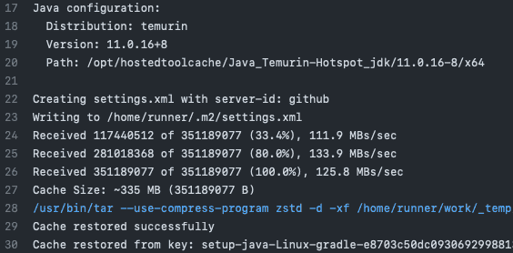

한 [오픈소스 프로젝트](https://github.com/fosslight/fosslight)에서 리드 멘티로 활동하며 GitHub Actions 워크플로우 최적화에 기여하였습니다.
워크플로우를 개선하면서 알게 된 의존성 캐싱에 관하여 이야기해 보려 합니다.

<!-- end -->

---

## TL;DR

GitHub Actions의 워크플로우는 매번 새로운 가상환경에서 실행되기 때문에 의존성 패키지를 워크플로우마다 설치해야 합니다.
이 과정에서 네트워크의 사용이 증가하고 런타임이 길어지므로 결국 시간과 자원의 낭비로 이어지게 됩니다.
이러한 문제를 해결하기 위해 GitHub에서는 `의존성 캐싱` 기능을 지원합니다.

---

## 의존성 캐싱

GitHub의 [actions/cache](https://github.com/actions/cache)를 사용하면 의존성들을 손쉽게 캐시할 수 있습니다.
이 action은 key 값을 기반으로 캐시를 가져옵니다. 만약 key에 해당하는 캐시가 있으면, path에 지정된 경로에 데이터를 복원합니다.
반대로 key에 해당하는 캐시가 없으면, 해당 작업이 성공적으로 끝날 경우에 자동으로 새로운 캐시를 생성합니다. 이때 새로운 캐시는 path 경로에 있는 파일들로 구성됩니다.

```yml
- uses: actions/cache@v3
  with:
      path: |
          path/to/dependencies
          some/other/dependencies
      key: ${{ runner.os }}-${{ hashFiles('**/lockfiles') }}
```

### 사용 제한과 제거(eviction) 정책

GitHub은 7일 이상 액세스하지 않은 캐시를 제거합니다.
저장할 수 있는 캐시의 수에는 제한이 없지만, 저장소에 있는 모든 캐시의 총량은 10GB로 제한됩니다.
만약 용량 제한을 초과하면, 용량이 10GB 아래로 조정될 수 있게끔 GitHub이 캐시를 제거합니다.

### restore-keys

key가 일치하지 않을 경우를 대비하여 여러 key를 `restore-keys`에 지정할 수 있습니다.
이때 restore-keys 목록에 작성된 순서대로 탐색을 진행합니다.

```yml
restore-keys: |
    npm-feature-${{ hashFiles('package-lock.json') }}
    npm-feature-
    npm-
```

### cache-hit

[actions/cache](https://github.com/actions/cache)의 출력값 `cache-hit`을 통해 의존성 패키지를 설치하는 step에 캐시의 존재 여부를 확인하는 조건을 추가할 수 있습니다.

key에 맞는 캐시가 존재하는 경우를 `cache hit`이라고 하며, cache-hit의 값은 true가 됩니다.
반대로 key에 맞는 캐시가 없는 경우는 `cache miss`라고 하며, 해당 작업이 성공적으로 끝났을 경우 새로운 캐시를 생성합니다.
cache miss가 발생하면 action은 restore-keys를 대안키로 사용하여 재탐색합니다.

```yml
- name: Install Dependencies
  if: steps.node-cache.outputs.cache-hit != 'true'
  run: npm install
```

---

## 프로젝트에 적용하기



프로젝트에서는 [actions/setup-java](https://github.com/actions/setup-java)를 통해 java 버전을 설정하고 있었습니다.
이 action은 [actions/cache](https://github.com/actions/cache)를 내장하고 있어 복잡한 설정 없이 의존성 캐싱을 적용할 수 있습니다.

```yml
steps:
    - uses: actions/checkout@v3
    - uses: actions/setup-java@v3
      with:
          java-version: "11"
          distribution: "temurin"
          cache: "gradle"
    - run: ./gradlew build
```

---

## 마치며

워크플로우에 `의존성 캐싱`을 도입함으로써 오래 걸리던 CI 속도를 60초 이상 단축할 수 있게 되었습니다.
이 글이 GitHub Actions를 사용하는 다른 개발자분들께도 도움이 되었으면 합니다.

---

## 참고 링크

-   [카카오웹툰은 GitHub Actions를 어떻게 사용하고 있을까?](https://fe-developers.kakaoent.com/2022/220106-github-actions/)
-   [Caching dependencies to speed up workflows](https://docs.github.com/en/actions/using-workflows/caching-dependencies-to-speed-up-workflows)
